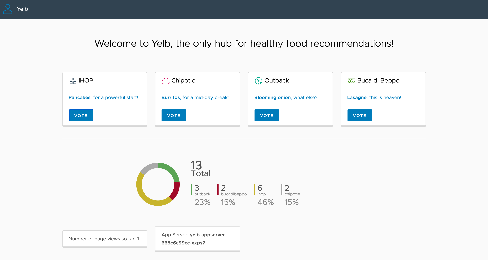

# Yelb: a Kubernetes sample application

This project includes a set of Kubernetes manifest files to deploy
[Yelb](https://github.com/mreferre/yelb), a Kubernetes sample application.



This application is made of several components:

- a frontend UI built with NodeJS
- a backend built with Ruby
- a Postgres database
- a Redis database

Thanks to this repository, you'll be able to verify pod networking and ingress setup
for your Kubernetes cluster.

## Prerequisites

Make sure you have the [Carvel](https://carvel.dev) toolset installed.
If not, please [follow these instructions](https://carvel.dev/#install).

You may deploy this application to any Kubernetes 1.19+ clusters.

## How to use it?

The Kubernetes manifest files in this repository are leveraging
[`ytt`](https://carvel.dev/ytt/), an open source YAML templating tool.

Using `ytt`, you can apply overlays to your YAML files, which allows you to tune your
deployment depending on your Kubernetes cluster: for example
sometimes you want to enable ingress, or you want to enable TLS.
It's easy to handle different deployment targets with `ytt` overlays.

This repository also supports different environment settings. Head over to the
[default environment settings file](bundle/config/values.yml)
to see the different parameters:

```yaml
#@data/values
---
#! Set application name.
APP: yelb

#! Set target namespace.
NAMESPACE: yelb

#! Set the public-facing domain used for accessing the application (ingress only).
DOMAIN: yelb.example.com

#! Set cert-manager cluster issuer to use when ingress TLS is enabled.
CERT_MANAGER_CLUSTER_ISSUER: letsencrypt-staging

#! Set to true to include NetworkPolicy objects, enforcing traffic rules.
ENABLE_NETWORK_POLICIES: true
```

Depending on your Kubernetes configuration, you may want to use your own settings
for your environment. In this case, create a new file `values.yml` in
`bundle/config-env/foo`, overriding the values set in the default environment settings file:

```yaml
#@data/values
---
#! File: bundle/config-env/foo/values.yml
#! Environment: foo
APP: yelb-foo
NAMESPACE: yelb-foo
ENABLE_NETWORK_POLICIES: false
```

At this point, you are ready to deploy this app using your environment settings file:

```shell
make ENV=foo deploy
```

You may switch to any environment settings file (a directory in `bundle/config-env`)
with the `ENV` variable:

```shell
make ENV=prod deploy
```

The `Makefile` file defines several targets you can use:

- `deploy`: use in-cluster services only (use `kubectl port-forward` to access the app)
- `deploy-lb`: use a `LoadBalancer` to expose the app (provided your cluster supports this configuration)
- `deploy-ingress`: rely on an ingress controller to expose the app (you can use any ingress implementations)
- `deploy-ingress-tls`: same as above with automatic TLS certificate generation (powered by `cert-manager`)

For example, use this command to deploy the app with settings for the `prod` environment,
leveraging an ingress controller and TLS certificate generation:

```shell
make ENV=prod deploy-ingress-tls
```

If you need to uninstall the app, use this command:

```shell
make ENV=myenv undeploy
```

## Advanced usage

The targets defined in `Makefile` are actually a shortcut to `ytt`, `kbld` and `kapp`
(part of the Carvel toolset). In this section you'll find advanced use cases for
deploying the app.

### Selecting overlays when deploying the app

By using `ytt`, you can generate the Kubernetes configuration for deployment.
Adding overlays to your deployment is quite easy:

```shell
ytt -f config -f config-env/prod -f config-ext/load-balancer.yml
```

You'll find overlays for each environment settings in `config-env`.

There are also single overlay files in `config-ext` (overlay extensions).
This is where you can find the definitions for using a load balancer
or an ingress for example.

Using the command above would only generate the Kubernetes configuration:
no deployment is done by `ytt`.

The idea is to use the `ytt` output with `kubectl` to deploy the app:

```shell
ytt -f config -f config-env/prod -f config-ext/load-balancer.yml | kubectl apply -f -
```

If you want to learn more about `ytt`,
[follow this guide on Tanzu Developer Center](https://tanzu.vmware.com/developer/guides/ytt-gs/).

### Deploying the app to an airgapped environment

Thanks to the Carvel toolset, it's easy to deploy this app to any Kubernetes clusters,
including airgapped environments.

This Kubernetes app is packaged as a bundle, relying on `imgpkg` to wrap everything
as a single OCI image (including overlays, environment settings files,
and also every images used by pods).

Using this bundle, you can then copy the OCI image as a file (TAR archive) to your
target environment. Feel free to use your USB flash drive :)

Use this command to extract the bundle as a file:

```shell
imgpkg copy -i ghcr.io/alexandreroman/yelb-app --to-tar yelb.tar
```

Copy the bundle archive to your airgapped environment.
You can then use this command to upload the bundle to your private container registry:

```shell
imgpkg copy --tar yelb.tar --to-repo myregistry.cluster.internal/myrepo/yelb
```

As you upload the bundle to your container registry, `imgpkg` would also automatically
rewrite the path to every container images used by the pods of this application.

You can then extract the content of this archive to your workstation:

```shell
imgpkg pull -b myregistry.cluster.internal/myrepo/yelb -o bundle-local
```

A new directory `bundle-local` is created, with the content of the offline bundle.
All images used by the pods of the Kubernetes app are also stored in your private
container registry (see file `bundle-local/.imgpkg/images.yml` for details).

Use this command to generate the Kubernetes manifest files, mapping the original
images with the new ones stored in your private container registry thanks to
`kbld` and `imgpkg`:

```shell
cd bundle-local
ytt -f config -f config-env/prod -f config-ext/load-balancer.yml | kbld -f - -f .imgpkg/images.yml
```

Reuse the same command with `kubectl` to deploy the app to your Kubernetes cluster:

```shell
ytt -f config -f config-env/prod -f config-ext/load-balancer.yml | kbld -f - -f .imgpkg/images.yml | kubectl apply -f -
```

As an alternative to `kubectl`, you may use `kapp-controller`,
a continuous deployment tool from the Carvel toolset.

### Using kapp-controller as a continuous deployment tool

Make sure your target cluster has `kapp-controller` running. If not, please
[follow these instructions](https://carvel.dev/kapp-controller/docs/latest/install/).
Note that every Tanzu clusters come with `kapp-controller` installed.

Before you deploy the app to your cluster, you need to set the path to your private
container registry in `app/app.yml`:

```yaml
apiVersion: kappctrl.k14s.io/v1alpha1
kind: App
metadata:
  name: yelb
spec:
  serviceAccountName: cluster-admin-sa
  fetch:
  - imgpkgBundle:
      image: myregistry.cluster.internal/myrepo/yelb
  template:
  - ytt:
      paths:
      - config
      - config-ext/ingress.yml
      - config-ext/ingress-tls.yml
      - config-env/prod
  - kbld:
      paths:
      - "-"
      - .imgpkg/images.yml
  deploy:
  - kapp: {}
```

As you can see, you may also tune the overlays that you'd like to use for your deployment.

You're now ready to deploy the app to your target cluster:

```shell
kubectl apply -f app
```

With this command, you tell `kapp-controller` to deploy the app from a bundle stored in
your private registry. A service account is used to create the Kubernetes resources on
the cluster (see file [cluster-admin.yml](app/cluster-admin.yml)).

You can of course use `kapp-controller` to deploy your app to any Kubernetes clusters:
it's a great continuous deployment tool, not only for airgapped environments.
[Check out this article on Tanzu Developer Center](https://tanzu.vmware.com/developer/guides/kapp-controller-gs/)
to learn more about the benefits of using `kapp-controller`.

Enjoy!

## Contribute

Contributions are always welcome!

Feel free to open issues & send PR.

## License

Copyright &copy; 2022 [VMware, Inc. or its affiliates](https://vmware.com).

This project is licensed under the [Apache Software License version 2.0](https://www.apache.org/licenses/LICENSE-2.0).
